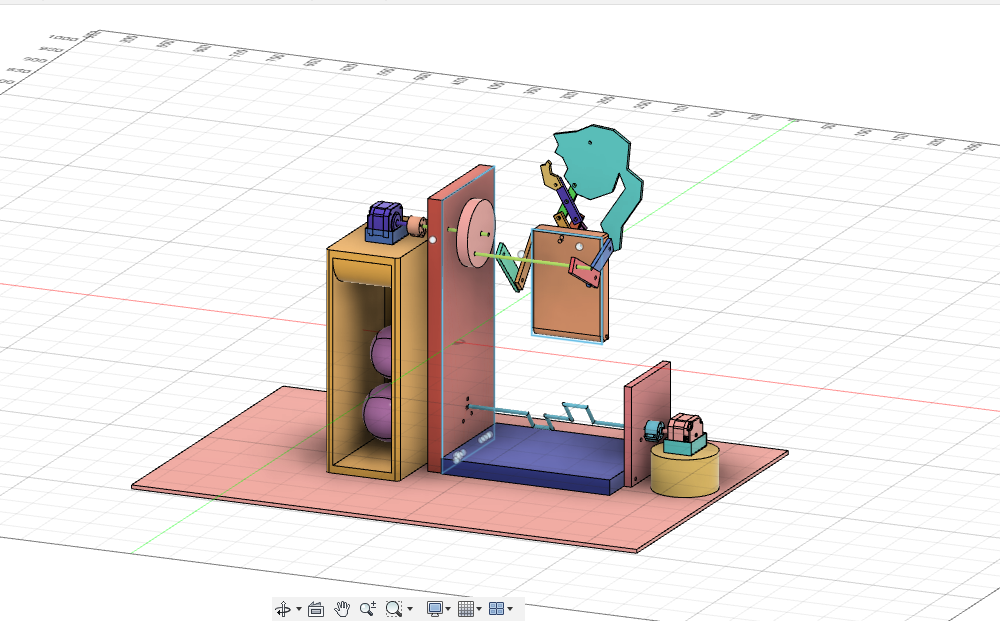
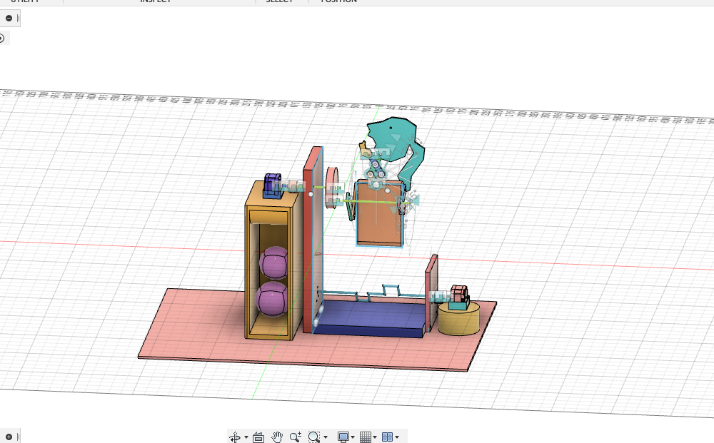
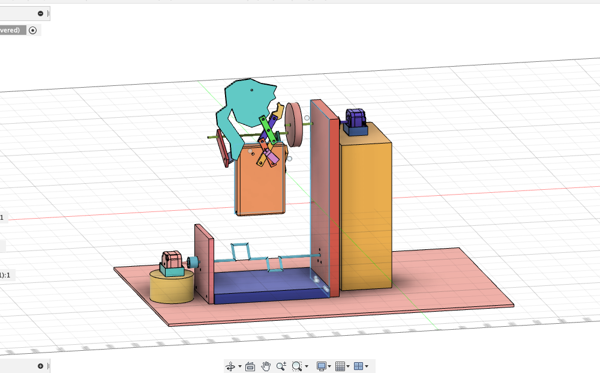
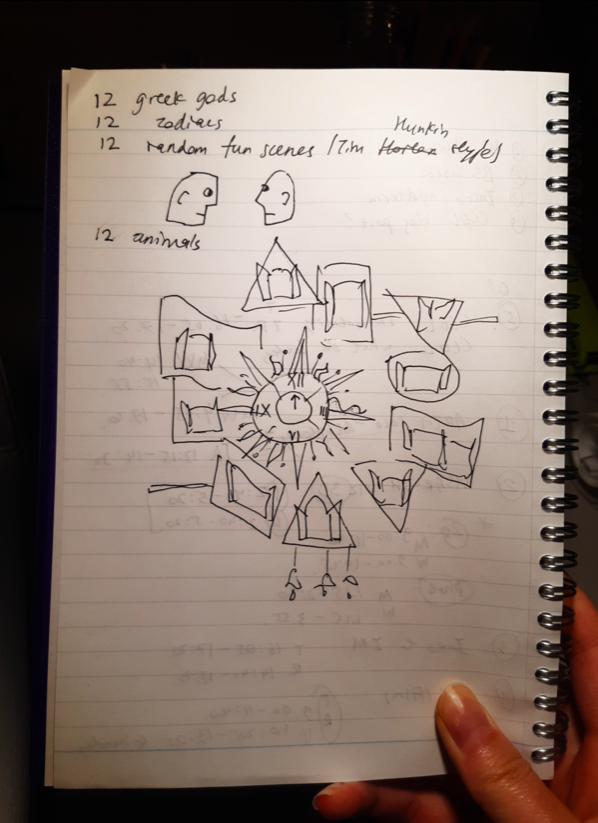
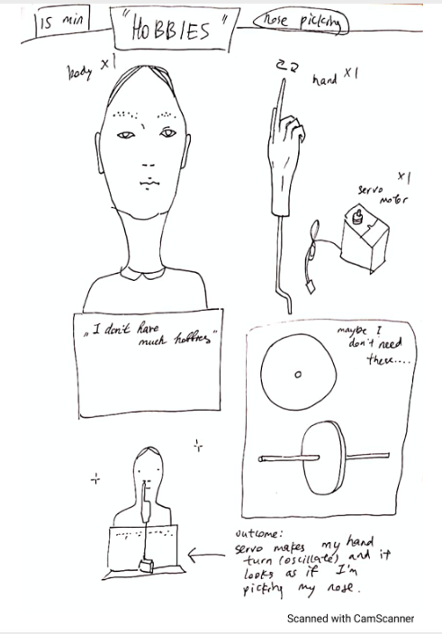
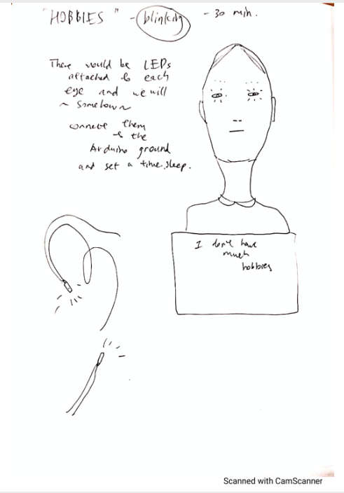
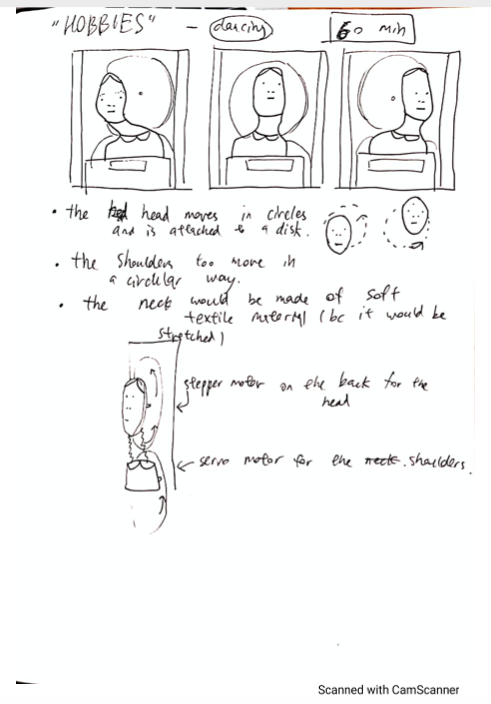
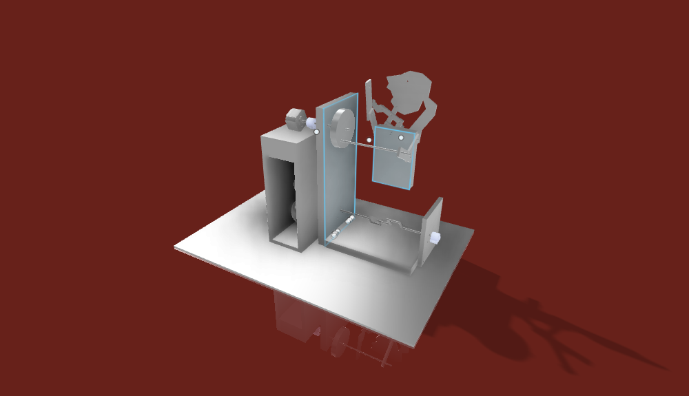

# Final Project: Gym Machine
## Overview
This final project is essentially a mechanism of an automata built in Autodesk Fusion 360. It is an embodiment of my aspirations and desire to start a healthy lifestyle by going to gym every day. The automaton is an Alter-Ego of me that never feels lazy because it is a machine and always attends the gym sessions. 
The project is meant to be manufactured by 3D printing and laser cutting, as well as adding some parts cut from fabric. In order to assemble the automata and make it work, 5 mm bolts and nuts, as well as two stepper motors and a servo motor are needed along with the Arfuino motor shield. 
Originally the idea was that all students of the machine lab class would make 12 mechanisms (united by the same theme "hobbies") to put in a big clock, and every hour/30 minutes the mechanisms, would start making some movements. 

Fusion file: https://a360.co/3ctY64r

Final Result (front):

Final Result (front with joints):

FInal Result (back):

## April 1st: Initial Brainstorm - Themes&Ideas

We were given the homework to come up with three ideas of the themes that we all would stick to.
In the picture below you can see my initial ideas and also a design of the big clock, where we would put all our mechanisms.

## April 6th: Arriving at a sketch
After one of the students, Ivory, proposed a common theme, hobbies, we all made a poll and chose this as the final theme.
I personally have a lot of hobbies like doing graphic design or collecting postcards and objects from Soviet era, but I thought that these might be very hard to implement in a way that people would understand what the mechanism is doing.
I did some research, and I bumped into some amazing mechanisms that Tim Hunkin made. I thought that it would be cool if I could make something similar. Though most of his machines are complex, there was a very cool one, which principle I happened to understand. It is called "The Disgusting Spectacle", and here is the video (at 1:23): https://youtu.be/uzWi0dAxYOs. 

So my initial sketch was inspired by this nose picking machine. I understand that nose picking alone can't be a hobby, so I added blinking and head shaking too. :-DDDDDDDD
Here it is. 

## April 8th: Defining the sketch

## April 13th: Defining dimensions, tools, materials

## April 14th: I changed the idea!

## April 15th and 20th

## April 22nd

## April 27th

## April 29th

## May 3rd

## May 6th

## May 11th: More Final Touches

Final Result (rendered):

