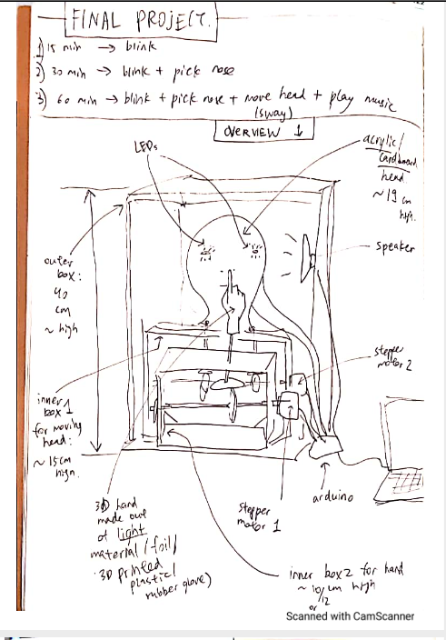
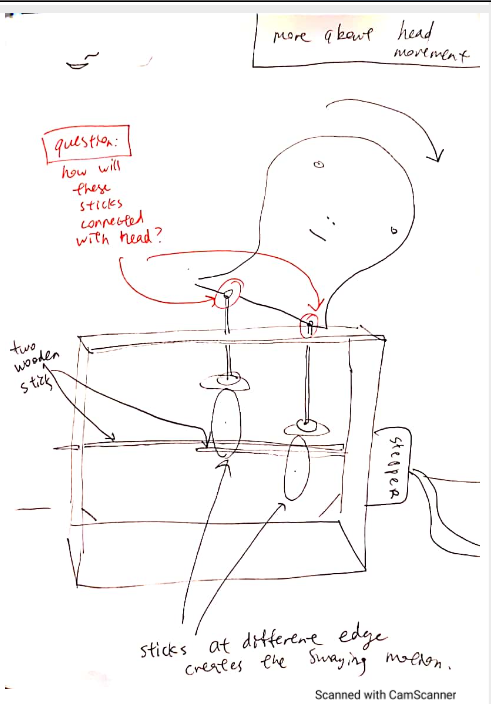
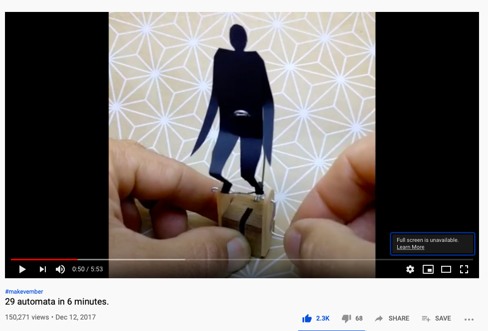
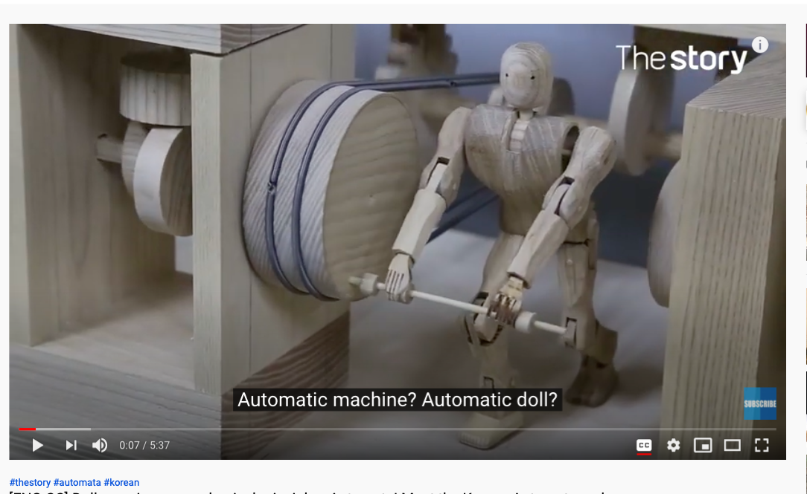
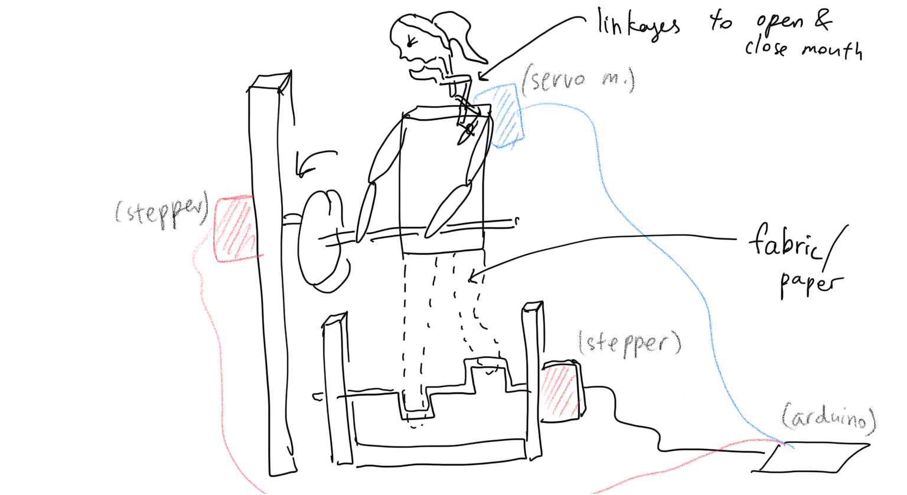
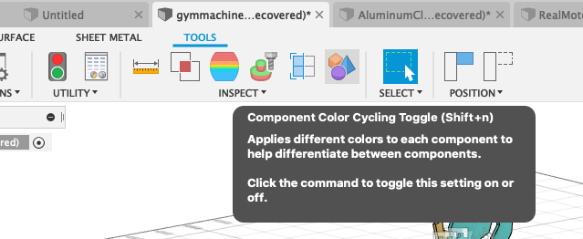
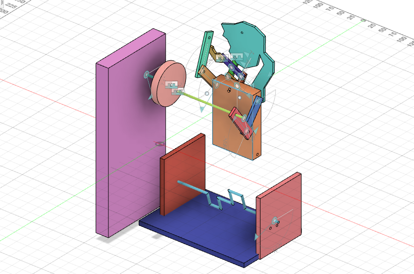

# Final Project: Gym Machine
## Overview
This final project is essentially a mechanism of an automata built in Autodesk Fusion 360. It is an embodiment of my aspirations and desire to start a healthy lifestyle by going to gym every day. The automaton is an Alter-Ego of me that never feels lazy because it is a machine and always attends the gym sessions. 
The project is meant to be manufactured by 3D printing and laser cutting, as well as adding some parts cut from fabric. In order to assemble the automata and make it work, 5 mm bolts and nuts, as well as two stepper motors and a servo motor are needed along with the Arfuino motor shield. 
Originally the idea was that all students of the machine lab class would make 12 mechanisms (united by the same theme "hobbies") to put in a big clock, and every hour/30 minutes the mechanisms, would start making some movements. 

Fusion file: https://a360.co/3ctY64r

Final Result (front):

**Note: the legs are supposed to be made of fabric/paper**

Final Result (front with joints):

FInal Result (back):

## April 1st: Initial Brainstorm - Themes&Ideas

We were given the homework to come up with three ideas of the themes that we all would stick to.
In the picture below you can see my initial ideas and also a design of the big clock, where we would put all our mechanisms.

## April 6th: Arriving at a sketch
After one of the students, Ivory, proposed a common theme, hobbies, we all made a poll and chose this as the final theme.
I personally have a lot of hobbies like doing graphic design or collecting postcards and objects from Soviet era, but I thought that these might be very hard to implement in a way that people would understand what the mechanism is doing.
I did some research, and I bumped into some amazing mechanisms that Tim Hunkin made. I thought that it would be cool if I could make something similar. Though most of his machines are complex, there was a very cool one, which principle I happened to understand. It is called "The Disgusting Spectacle", and here is the video (at 1:23): https://youtu.be/uzWi0dAxYOs. 

So my initial sketch was inspired by this nose picking machine. I understand that nose picking alone can't be a hobby, so I added blinking and head shaking too. :-DDDDDDDD
Here it is. 

## April 8th and 13th: Defining the sketch & Defining dimensions, tools, materials
After class discussions I found out that the initial idea of head shaking would not work. I was hoping to attach the head to the edge of a disk and have it rotated by a stepper motor, but it the head was attached rigidly, it would end up going in circles and rotating 360 degrees - which is not how a human head works. Moreover, this would make the neck impossible to attach, because it would end up entangled. In order to make the face stay straight, some kind of mechanism depending on the force of gravity would be needed. One solution for that could be rigidly ataching a stick to the edge of the disk (rotated by a stepper motor), making a hole on the top of the face and leave it hanging on the stick. Does that make sense? Anyways, I decided to think of another solution that would not 1) put too much pressure on the motor, 2) be difficult to implement in Fusion (like gravity) 3) generally be an ugly solution
Long story short, I tweaked my sketch and this is what I came up with. All the essnetial info (material, dimension, etc) is hand-written so I am sorry for my handwritting! Hopefully the drawing is at least clear.

Below is the overview

Below is the detailed depiction of head shaking motion 

Implementation in Fusion 360? I thought of starting with making the basic mechanisms - cams and the mechanism moving the head - first. Then move on to the nose picking motion that is similar in implementation, and lastly do the decorations - the head itself, hand, etc.
Machines used to fabricate? Didn't know at that point. 
How pieces are going to be attached? Using screws, bolts, as well as hot glue, which I realized was not a good idea. 
And then...

## April 14th: I changed the idea!

Why? Because I did not want to challenge Fusion and its functions. Making the initial project in real life would be much easier. I realized that, because of the lack of gravity in Fusion and other things, that implementation would require a lot of unnecessary work. Which is why I chose to do something that would 100% work. For that, I had to give up my cams and think of some other mechanisms, while integrating all of them in one automata.
I drew inspiration from some easy DIY automatas. Link here: https://youtu.be/-OJ1Yc2SwAs ("29 automatas in 6 minutes").
Especially this:

So I needed to have three easy mechanisms in one place. So I came up with a Gym Machine which would have three movements: running, turning a disk like the automata in the picture above, and ehhhh stretching neck? shouting motivational quotes? (I had to add a third motion so anything could do the job):

**Difficulties: I realised that making the legs in Fusion might be too much work in terms of eliminating conflicts in joints. Since we are to make the machine in real life after all, i decided to employ the same technique as in the picture from youtube - making the legs from fabric/paper.**
**So the final version would not have Fusion legs!**

We will see other issues during the process of actually making the machine in Fusion. 

## April 15th and 20th: I made the machine in Fusion! Now it's only the matter of adding on and fine-tuning.

During one of the days from 14th fo 20th, I decided to sit down and just make the whole thing. Which I did.
I made all three mechanisms and they worked perfectly. 
I even found a way to color all the parts in 1 second using Component Color Cycling Toggle tool:

OK. Now the design itself.

## April 22nd: 

## April 27th

## April 29th

## May 3rd: Adding Motors

## May 6th: Final Touches - how to attach the motor?

## May 11th: More Final Touches

Final Result (rendered):

