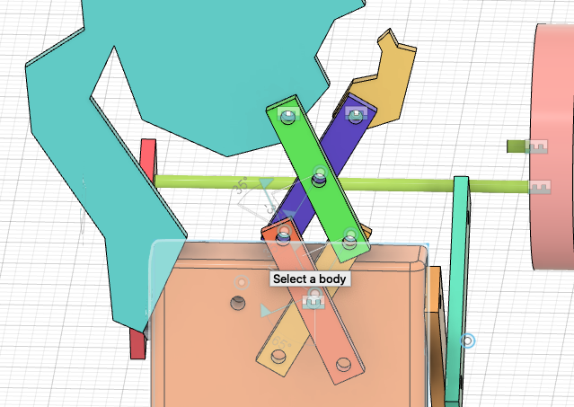
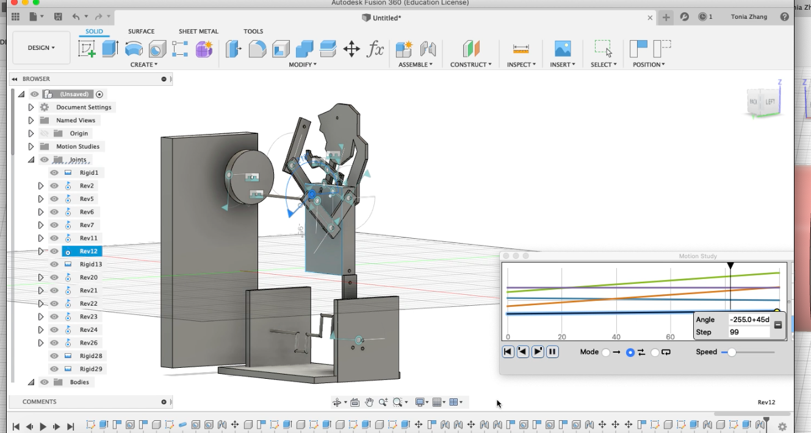
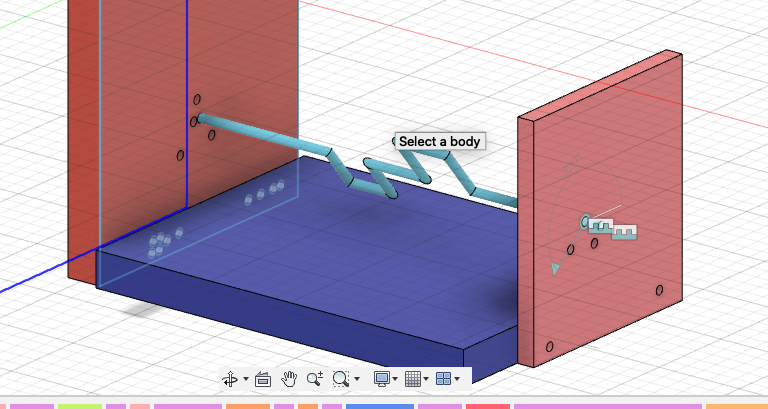
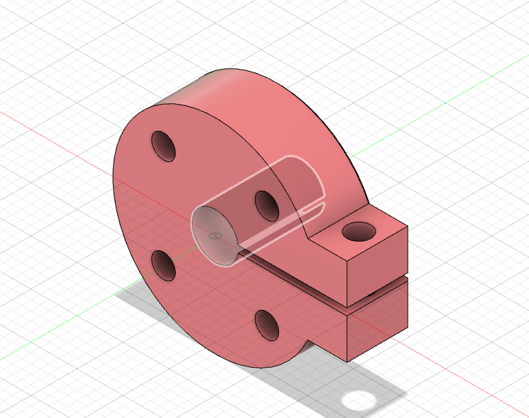
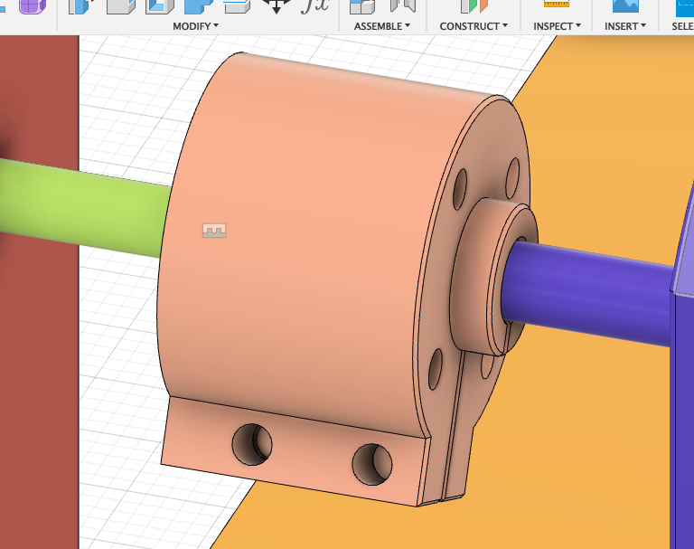
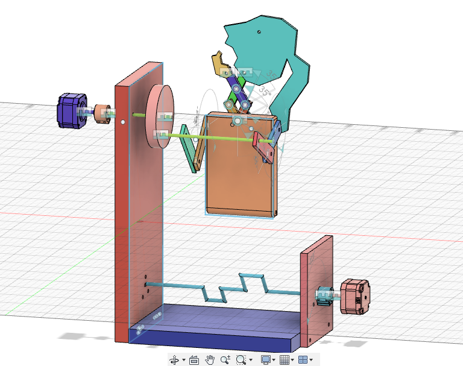
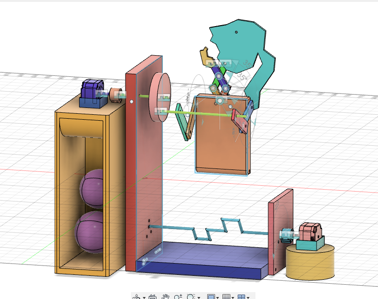
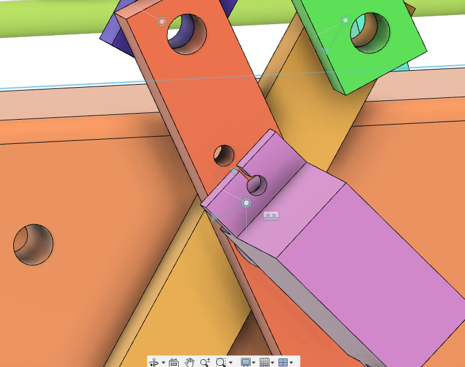

# Final Project: Gym Machine
## Overview
This final project is essentially a mechanism of an automata built in Autodesk Fusion 360. It is an embodiment of my aspirations and desire to start a healthy lifestyle by going to gym every day. The automaton is an Alter-Ego of me that never feels lazy because it is a machine and always attends the gym sessions. 
The project is meant to be manufactured by 3D printing and laser cutting, as well as adding some parts cut from fabric. In order to assemble the automata and make it work, 5 mm bolts and nuts, as well as two stepper motors and a servo motor are needed along with the Arfuino motor shield. 
Originally the idea was that all students of the machine lab class would make 12 mechanisms (united by the same theme "hobbies") to put in a big clock, and every hour/30 minutes the mechanisms, would start making some movements. 

Fusion file: https://a360.co/3ctY64r

Final Result (front):

**Note: the legs are supposed to be made of fabric/paper**

Final Result (front with joints):

FInal Result (back):

## April 1st: Initial Brainstorm - Themes&Ideas

We were given the homework to come up with three ideas of the themes that we all would stick to.
In the picture below you can see my initial ideas and also a design of the big clock, where we would put all our mechanisms.

## April 6th: Arriving at a sketch
After one of the students, Ivory, proposed a common theme, hobbies, we all made a poll and chose this as the final theme.
I personally have a lot of hobbies like doing graphic design or collecting postcards and objects from Soviet era, but I thought that these might be very hard to implement in a way that people would understand what the mechanism is doing.
I did some research, and I bumped into some amazing mechanisms that Tim Hunkin made. I thought that it would be cool if I could make something similar. Though most of his machines are complex, there was a very cool one, which principle I happened to understand. It is called "The Disgusting Spectacle", and here is the video (at 1:23): https://youtu.be/uzWi0dAxYOs. 

So my initial sketch was inspired by this nose picking machine. I understand that nose picking alone can't be a hobby, so I added blinking and head shaking too. :-DDDDDDDD
Here it is. 

## April 8th and 13th: Defining the sketch & Defining dimensions, tools, materials
After class discussions I found out that the initial idea of head shaking would not work. I was hoping to attach the head to the edge of a disk and have it rotated by a stepper motor, but it the head was attached rigidly, it would end up going in circles and rotating 360 degrees - which is not how a human head works. Moreover, this would make the neck impossible to attach, because it would end up entangled. In order to make the face stay straight, some kind of mechanism depending on the force of gravity would be needed. One solution for that could be rigidly ataching a stick to the edge of the disk (rotated by a stepper motor), making a hole on the top of the face and leave it hanging on the stick. Does that make sense? Anyways, I decided to think of another solution that would not 1) put too much pressure on the motor, 2) be difficult to implement in Fusion (like gravity) 3) generally be an ugly solution
Long story short, I tweaked my sketch and this is what I came up with. All the essnetial info (material, dimension, etc) is hand-written so I am sorry for my handwritting! Hopefully the drawing is at least clear.

Below is the overview

Below is the detailed depiction of head shaking motion 

Implementation in Fusion 360? I thought of starting with making the basic mechanisms - cams and the mechanism moving the head - first. Then move on to the nose picking motion that is similar in implementation, and lastly do the decorations - the head itself, hand, etc.
Machines used to fabricate? Didn't know at that point. 
How pieces are going to be attached? Using screws, bolts, as well as hot glue, which I realized was not a good idea. 
And then...

## April 14th: I changed the idea!

Why? Because I did not want to challenge Fusion and its functions. Making the initial project in real life would be much easier. I realized that, because of the lack of gravity in Fusion and other things, that implementation would require a lot of unnecessary work. Which is why I chose to do something that would 100% work. For that, I had to give up my cams and think of some other mechanisms, while integrating all of them in one automata.
I drew inspiration from some easy DIY automatas. Link here: https://youtu.be/-OJ1Yc2SwAs ("29 automatas in 6 minutes").
Especially this:

So I needed to have three easy mechanisms in one place. So I came up with a Gym Machine which would have three movements: running, turning a disk like the automata in the picture above, and ehhhh stretching neck? shouting motivational quotes? (I had to add a third motion so anything could do the job):

**Difficulties: I realised that making the legs in Fusion might be too much work in terms of eliminating conflicts in joints. Since we are to make the machine in real life after all, i decided to employ the same technique as in the picture from youtube - making the legs from fabric/paper.**
**So the final version would not have Fusion legs!**

We will see other issues during the process of actually making the machine in Fusion. 

## April 15th and 20th: I made the machine in Fusion! Now it's only the matter of adding on and fine-tuning.

During one of the days from 14th fo 20th, I decided to sit down and just make the whole thing. Which I did.
I made all three mechanisms and they worked perfectly. 
I even found a way to color all the parts in 1 second using Component Color Cycling Toggle tool:

OK. Now the design itself.

the neck linkages were a pain to make, but Michael kindly provided a very concise 5-minute tutorial with some nice-sounding BGM and it helped a lot.

**What I learnt:**
- for linkages, always copy the components to make them exactly the same. I was lazy and made random pieces that were similar, but because they were not identical, it resulted in a conflict.
- in general, ALWAYS COPY. I had the same issue of joint conflict when making the arms. Now, as you can see, only one arm is attached to the stick. It was supposed to be two but I could not attach it even after I remade all arm pieces to be identical. I thought that that might as well be just a Fusion problem, so I decided to move on. 
- think through the order of joints. Sometimes it might be more efficient to make the rigid joints first, other times revolute.
- it is of course better to set the dimensions first, but doing the design without dimensions is also possible. Just make sure that you understand the size of the initial piece, for example head, to approximate the size of the rest of the pieces. 
**Also, a very useful tool "Inspect-Measure" used in order to check the distance from one end of a piece to another.**

## April 22nd: Performing Automata in Fusion

I really wanted to see my mechanism in full motion. How every piece would move simultaneously, without me togling with the tiny flag next to each joint. Found an informative and concise tutorial: https://youtu.be/zHOIoZxtjjk "How to animate assembly in Fusion 360"

Made my own animation (uploaded as a google drive folder link - just enter it):
https://drive.google.com/drive/folders/1JbdvnoVaY9cgZVuwGch3VDQiPa0U6ql_?usp=sharing

## April 27th and 29th: What works in Fusion might not work in real life!

Indeed. You can make gigantic projects in Fusion, but how will you fabricate it?
At that time, the question of fabrication and communicating with ERB arose. 
I decided that my pieces would be either 3D printed or laser cut. 
One problem that I encountered was that one of the pieces was too large to be 3D printed. Luckly, that particular piece had holes only on the larger surface, so it could be done with a laser cutter as well. The only thing is, it has to be dense - arounf 10 or 20 mm. I am talking about the wall piece that is holding everything otgether. 

I also received feedback regarding the redundancy of some of the pieces, for example the red little "walls". So I removed them.
Another thing I did was adding more holes to make sure that the side wall pieces and the blue ground could be put together using 5 mm bolts and nuts (**all holes are 5 mm**). **I did not think about this at all, and forgot that it is only in Fusion where we can just defy gravity and leave things hanging in the air, sticking parts together by putting them next to each other, etc.**

Before:

After:

## May 3rd: Adding Motors and Shaft Couplers

Another question arose: how am I going to attach my motors to the rods?
- using shaft couplers.
I downloaded one that was sent to everyone in the class and modified it a bit by extending the coupler and adding another hole for more stability.

original:

modified:

At this point, things look like this:

## May 6th: Final Touches

We also agreed that it is necessary to ground the motors and give them some king of support. 
While usually it would be done by mounting then onto something, in my case I decided that making them a box-slot and a platform might be easier. 
Some platfors also serve decorative purposes and contribute to the "gym" feeling. For example, here I decided to add gym balls. 

Servo motor, on the other hand, could be mounted to a linkage that doesn't move, since there is nothing for it to hold on, and making another platform might ruin the aesthetic. So I added a hole to that linkage in order to later bolt the servo motor and the linkage together.

## May 11th: More Final Touches

We are basically done!
I added a ground panel and experimented with the rendering. 

This is the final product!

## Further Discussion

- Fabrication: everything should be laser-cut, except for the little boxes that hold the motors, shaft for moving the legs, body panel that has holes on two surfaces, cylindrycal platform, rods that are attached to the disk, disk, blue groud piece, balls, cupboard for the balls.

- Other components needed: 2 stepper motors, 1 servo motor, 5 mm bolts and nuts, two 3 mm bolts and nuts, hot glue to stick the machine to the ground, fabric/paper for the legs.

- Remaining concerns: hopefully things can be fabricated! hopefully next semester will not be online! other than that, no concerns. I don't expect things to turn out the way I wanted because I "hard-coded" some stuff, but I am very curious whether the machine can atually work out or what kind of issues will I see id I get the parts.

- Difficulties and Learning Outcomes: actually, it turned out that there are some surprsing similiarities between hands-on and fusion. I learned the importance of planning and thinking through the details as much as possible and trying not to "hard-code" stuff. In both "realities" the implementation I had in my head was way easier than what it actually turned out to be. However, with each problem encountered (such as joint conflicts, component/body mechanichs, the order of making things and putting joints, realizing that something would not work in reality that works in Fusion and vice versa), I gained more knowledge and made sure that in most cases I did not repeat the same mistake.**The major difficulty for me personally was the lack of a mindset of a mechanichal engineer. Sometimes I would not understand the simplest motions, as well as how to design a mechanism for a motion that I have in mind** However, I think that for this, years of practice are needed, and we should not hurry. In the end, I grasped the basics of Fusion, explored a few functions by myself on youtube, and I am happy with the learning outcome. 

